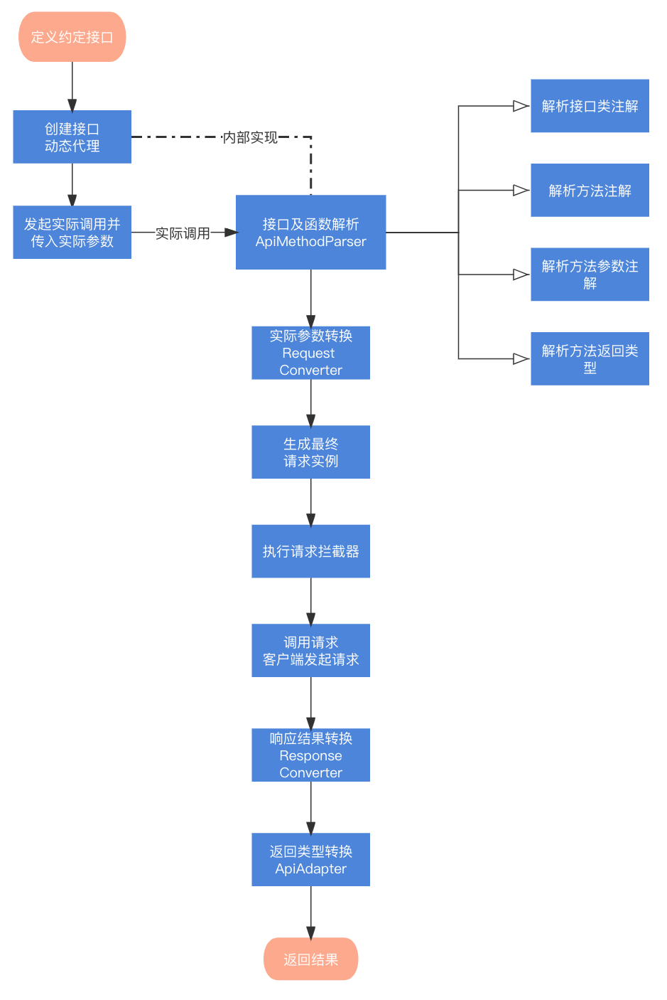

## 原理
整体原理参考 Retrofit 和 OkHttp。

通常我们说的接口是服务端和使用端双方约定好的抽象数据结构，同时约定好请求方式，抽象的数据结构正好可以使用语言中 Interface (即接口) 和 Annotation (注解) 来表达，按照约定数据字段来定义方法函数，用注解进一步表达关联关系及请求方式等。定义好抽象数据结构后下一步就会用到语言特性中动态代理 (Proxy.newProxyInstance(……)) 生成代理实例，发起实际调用时对定义好的接口及方法函数进行解析，按照一定规则解析出统一的请求结构信息(例如：请求 Path、请求参数类型、请求方式、返回数据类型)。再将实际参数与请求结构信息生成最终的请求实例，再执行拦截器对请求实例加工，再根据指定的请求客户端 (默认使用 HttpURLConnection) 发起实际请求，再读取出请求响应结果，根据解析的返回类型转换后返回。

不想看上面这段口水话，直接往下看。

#### 原理流程总结

1. 定义约定的抽象数据结构 (Interface 接口和 Annotation 注解)
2. 创建动态代理 Proxy.newProxyInstance(……) 实例
3. 发起实际调用，解析 Interface 实例得到请求结构信息
4. 用实际参数与请求结果信息生成最终请求实例
5. 执行拦截器对请求实例加工
6. 使用请求客户端发起实际请求得到响应结果
7. 根据解析的返回类型转换后返回

#### 原理流程图



整体的核心是解析接口及函数注解类型等信息，并根据实际参数生成请求实例(Request)发起请求，然后再讲请求响应结果根据返回类型转换成实际类型返回。


## 高级说明

GET、POST、HEAD、PUT、PATCH、DELETE、OPTIONS 请求方式都使用 @Api 注解，通过指定 method 属性设置请求方式，method 不指定时，默认为 POST。

### GET 请求

```
@Api("commitClientTime?createTime=10002345", method = HttpMethod.GET)
fun commitClientTime(@ApiField("time") time: Long): BaseResult<Void>
```

@Api value 属性值中 'commitClientTime' 为 path，'?createTime=10002345' 为默认的参数。可以使用 @ApiField 定义 time 字段参数，BaseResult 为统一封装返回的数据结构 Bean。

### POST 请求

#### 使用 x-www-form-urlencoded 方式提交

```
@Api("post/query")
    fun postQuery(
        @ApiField("type") type: String,
        @ApiField("page") page: Int,
        @ApiField("pageSize") pageSize: Int
    ): BaseResult<List<Item>>
```
@Api 默认请求方式为 POST ，所以 method 可以省略。@ApiField 定义接口参数，此声明方式默认使用表单方式提交。

#### 使用 application/json; charset=UTF-8 方式提交

```
//1.先定义一个参数实体类
data class ReqBody(val callId: Long, val callData: String)

//2.定义接口函数方法
@Api("post/body")
fun postBody(@ApiBody reqBody: ReqBody): BaseResult<Void>
```
@ApiBody 定义的接口参数，POST 方式提交时，会将 ReqBody 参数通过 Convert 转换后提交。

#### 使用 multipart/form-data 方式提交

```
@Api("post/part", isMultipart = true)
    fun postPartBody(
        @ApiPart("num") num: Int, 	//定义一个 num 字段，类型为Int
        @ApiPart("msg") msg: String?, 	 //定义一个 msg 字段，类型为String
        @ApiPart("partFile") singleFile: File,  //定义一个 partFile 字段，类型为文件
        @ApiPart part: MultipartBody.Part, //定义一个 Part 类型
        @ApiPart("contentRequestBody") contentRequestBody: RequestBody,//定义一个 contentRequestBody 字段，类型为 RequestBody
        @ApiPart partMap: Map<String, Any> //定义一个 Map 类型,可以传多个参数
    ): BaseResult<Void>
```

@Api 属性设置 isMultipart 为 true，再使用 @ApiPart 定义接口参数。

### 添加请求头

请求头添加常用有三种方式。

#### 定义接口函数时使用 @Api headers 属性

适用于单个接口添加固定请求头参数。

```
@Api(……，headers = ["X-CALL-ID:call123", "X-Token:token123456"])
```

#### 定义接口函数参数时 使用 @ApiHeader 注解

适用于单个接口添加动态请求头参数。

```
@Api("post/query")
fun postQuery(
        @ApiHeader("X-CALL-TIME") callTime: Long,
        @ApiHeader headers: Map<String, Any>,
        ……
    ): BaseResult<List<Item>>
```

#### 通过自定义拦截器重新构建 Request

适用于为所有接口添加公共请求头参数。

```
addInterceptor { chain ->
	val request = chain.request()
	val newRequest =
		request.newBuilder()
		.addHeader("X-CALL-ID", UUID.randomUUID().toString())
		.build()
	chain.proceed(newRequest)
```

### 请求动态 Path

先使用 @Api 定义接口 Path ，Path中使用一对花括号表示需要动态的部分，例如：'{xxx}'，xxx表示为需要替换的 key，然后接口函数中使用 @ApiPath("xxx") 定义需要替换的部分，@ApiPath value值需要与花括号中的 key 相同，最终执行时会将 path 字符串值去替换掉 '{xxx}'，生成动态的 Path。

```
@Api("post/{queryKey}")
fun postQuery(@ApiPath("queryKey") path: String): BaseResult<List<Item>>
```

### 切换 Url 地址

#### 切换绝对路径

初始化 Lemon 时 ApiUrl 初始化为 'https://xxx.xxx.xxx'，可以使用以下方法切换为 'https://yyy.yyy.yyy'

```
Lemon.build {
	setApiUrl("https://xxx.xxx.xxx")
	……  
}

@ApiUrl("https://yyy.yyy.yyy")
interface KotlinApiService {
……
}
```

KotlinApiService 下的所有接口函数执行时都会以 'https://yyy.yyy.yyy' 去拼接实际的 ApiUrl。

#### 定义统一的 Path
初始化 Lemon 时 ApiUrl 初始化为 'https://xxx.xxx.xxx'，可以使用以下方法去统一 Path 前缀。

```
Lemon.build {
	setApiUrl("https://xxx.xxx.xxx")
	……  
}

@ApiUrl("lemon/")
interface KotlinApiService {
@Api("post/body")
fun postBody(@ApiBody reqBody: ReqBody): BaseResult<Void>
……  
}
```

KotlinApiService 下所有的接口函数执行都会以 'https://xxx.xxx.xxx/' 去先拼接 'lemon/'，再去拼接@Api Path 'post/body'，示例中最终实际的 ApiUrl 为 'https://xxx.xxx.xxx/lemon/post/body'。

### 拦截器

#### 自定义拦截器

```
Lemon.build {
       ……
       addInterceptor { chain ->
		val request = chain.request()
		//添加公共请求头参数
		val newRequest =
			request.newBuilder()
			.addHeader("X-CALL-ID", UUID.randomUUID().toString())
			.build()
		//加密请求参数(待补充示例)
		chain.proceed(newRequest)
        }
       ……
        )
    }
```

#### 日志拦截器

日志拦截器是自定义拦截器的一种，默认提供。

```
addInterceptor(LemonLogInterceptor(LemonLogLevel.BODY))
```

日志等级（LemonLogLevel）分为 5 种：

* NONE
	* 无日志
* BASIC
	* 经典日志，仅显示请求发起和响应消息。
* HEADERS
	* 带请求头日志
* BODY
	* 带请求头、消息体日志 
* ALL
	* 带请求头、消息体、声明接口类及函数方法日志

**注意：线上环境请移除该拦截器(建议)或将拦截器日志等级设置为 LemonLogLevel.NONE ，否则会可能会泄漏请求数据。**	
### LemonSpace

LemonSpace 是普通网络请求场景的简单封装类，可以用于 UI 生命周期绑定、UI 进度切换、自动切换 UI 与 IO 线程。

如果你未使用官方提供的 ViewModel 方式，则可以使用 LemonSpace。

```
//第一步，初始化 Lemon 实例时添加 LemonSpace 返回类型转换工厂
Lemon.build {
	……
	addApiAdapterFactory(LemonSpaceApiAdapterFactory())
	……
}

//第二步，定义接口时函数方法返回值 LemonSpace<T>
interface TstLemonSpaceApiService {
    @Api("tst/api.php")
    fun languageTranslation(@ApiField("text") text: String): LemonSpace<TstResult>
}

///第三步，发起调用并添加 UI 生命周期绑定和进度控制
Net.getTstLemonSpaceApiService().languageTranslation(text)//发起接口调用，返回 LemonSpace 实例
	.bindLifecycle(viewLifecycleOwner, Lifecycle.Event.ON_DESTROY)//绑定 UI 生命周期
	.doStart { progressView.show() } //开始时显示进度 UI
	.doEnd { progressView.dismiss() }//结束时隐藏进度 UI
	.doError {binding.resultTv.text = "语言翻译异常：${it.message}"} //监听异常错误
	.request {binding.resultTv.text = Gson().toJson(it)}//发起实际请求调用并监听结果回调
```

LemonSpace 内部会控制 IO 与 UI 线程的调度，请求调用会在 IO 线程中执行，doStart、doEnd、request 回调会在 UI 线程中执行。

#### 进一步封装

可以对绑定 UI 生命周期和进度控制逻辑进一步封装，添加扩展文件 LemonSpaceExt.kt 和 ProgressView UI 控制接口(请参考 app 示例代码)

```
fun <T> LemonSpace<T>.bindUi(
    progressView: ProgressView,
    owner: LifecycleOwner,
    event: Lifecycle.Event = Lifecycle.Event.ON_DESTROY
): LemonSpace<T> {
    return bindLifecycle(owner, event)//绑定 UI 生命周期
        .doStart { progressView.show() } //开始时显示进度 UI
        .doEnd { progressView.dismiss() } //结束时隐藏进度 UI
}
```

可以进一步简化实际调用方式，最终调用方式如下：

```
Net.getTstLemonSpaceApiService().languageTranslation(text)
                .bindUi(progressView, viewLifecycleOwner)//UI 生命周期绑定和进度控制
                .doError {binding.resultTv.text = "语言翻译异常：${it.message}"}//异常错误处理
                .request {binding.resultTv.text = Gson().toJson(it)}//处理正常回调
```


